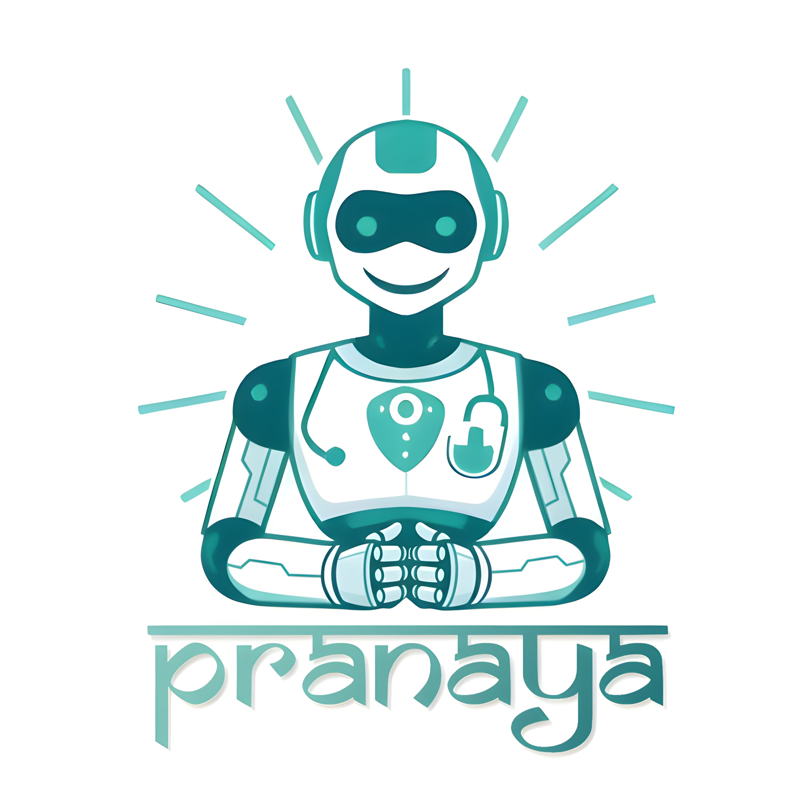

#  PRANAYA  — The Agentic Multilingual AI Health Chatbot  

> *“Healthcare made human — powered by AI, empathy, and intelligence.”*

---

## Overview  

**PRANAYA** is an **Agentic, Multilingual Health Chatbot** designed to deliver *personalized, accessible, and intelligent* healthcare support for everyone — regardless of language, literacy, or location.  

It merges **AI reasoning**, **speech recognition**, **multilingual translation**, and **emergency awareness** into a single compassionate assistant.  
Powered entirely by **local inference (Whisper + Ollama)** for privacy and reliability, PRANAYA acts as your personal health companion — capable of guiding, calming, and supporting you in your own language.  

---

##  Key Features  

###  End-to-End Multilingual Voice AI  
-  Offline **Whisper (OpenAI)** for speech-to-text  
-  **LangDetect + Google Translate** for understanding any dialect  
-  **gTTS** generates natural, localized voice responses  

###  Agentic AI Reasoning  
-  **Ollama (Llama 3)** + **LangChain** reasoning layer  
-  Detects possible illnesses, symptoms, and provides actionable advice  
-  Acts as a **psychological listener** offering gentle emotional support  
-  Generates **context-aware nudges** for continuous health conversation  

###  Emergency Detection & Real-Time Support  
- Detects critical keywords (*chest pain, fainting, bleeding, etc.*)  
- Activates real-time triage with first-aid instructions  
- Uses **GeoPy** to identify **nearby hospitals** and display emergency alerts  

###  Personal Wellness Tracker  
- Track **daily water intake** with **live pie-chart progress**  
- Log and predict **menstrual cycles**  
- Manage **vaccination schedules** with editable vaccine lists  

---

##  Tech Stack  

| Category | Technology |
|-----------|-------------|
| **Backend Framework** | Flask (Python) |
| **Speech AI** | Whisper (OpenAI Offline) |
| **LLM Reasoning** | Ollama (Llama 3) + LangChain |
| **Translation & Voice** | Google Translate, gTTS |
| **Database** | SQLite (Local & Private) |
| **Frontend** | HTML, CSS, JavaScript |
| **Geolocation** | GeoPy |
| **Planned Scheduling** | Python `schedule` + TinyDB |

---

##  Future Enhancements  

-  **Dialect-matched voice refinement** for regional accents  
-  **Image / Report / X-ray analysis** with AI explanations  
-  **User health history database** & progress dashboard  
-  **Medication & vaccination reminders** based on custom schedules  
-  **BP & blood-sugar tracking** with trend visualization  
-  **Connect Feature:** allow loved ones to securely view shared reports  

---

##  Confidential Components  

>  The backend logic of PRANAYA — including **Whisper + Ollama integration**,  
> **LangChain reasoning**, and **emergency-AI framework** — has been intentionally excluded  
> to protect intellectual property and API security.  

This repository includes only the **safe, front-end and placeholder code** for demonstration.  
See [`CONFIDENTIAL_FILES.md`](./CONFIDENTIAL_FILES.md) for details.  

---

## Repository Structure  
PRANAYA-Health-Chatbot/
┣ 📜 .gitignore
┣ 📜 README.md
┣ 📜 app.py (demo placeholder)
┣ 📜 index.html
┣ 📜 style.css
┣ 📜 script.js
┣ 📜 trackers.css
┣ 📜 trackers.js
┣ 📜 vaccines.json
┣ 📸 pranaya_logo.jpg
┗ 📜 CONFIDENTIAL_FILES.md

##  About the Project  

PRANAYA bridges the digital divide in healthcare by making **AI-powered, empathetic, multilingual assistance** universally accessible.  
It’s designed not just to respond, but to **understand, reassure, and empower** users to take charge of their health with confidence.  

> *“PRANAYA isn’t just built to assist — it’s built to care.”*   

---

##  Developed By  

**Soulima Biswas**  
 *[soulimabiswas@gmail.com]*  
 *[www.linkedin.com/in/soulima-b-239293335]*  

---

